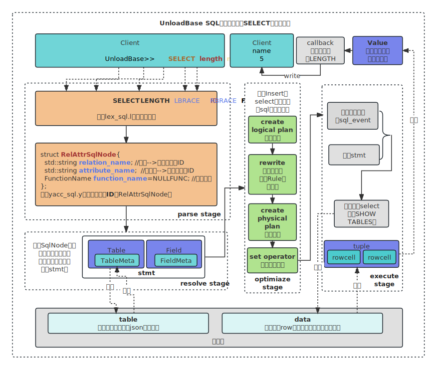

#  UnloadBase

## :black_nib: 基于miniob开发的轻量数据库:black_nib:

### 


UnloadBase是基于miniob开发的轻量数据库，采取miniob的架构并完善了相关功能，未来将探索多模方向

- [miniob github地址](https://github.com/oceanbase/miniob) 

- [miniob文档地址](https://oceanbase.github.io/miniob/miniob-introduction.html)

## :pencil2:UnloadBase架构



## :whale:下载须知 :feet:

本数据库当前基于四个三方库构建，均以子模块(submodule)的方式在github中链接，下载时请使用下面的命令确保子模块成功下载

```shell
git clone --recursive ${url}
```

## :articulated_lorry: 环境准备

无论在任何环境上编译，请确保你的环境拥有以下工具链：

```shell
(你的环境上应已经安装了make工具)
cmake 版本 >= 3.13
gcc/clang gcc建议8.3以上，编译器需要支持c++20新标准
flex (2.5+), bison (3.7+) 用于生成词法语法分析代码
```

如果你是Mac用户，请使用homebrew更新你的bison工具，Mac原生bison工具版本落后太多

## :thinking: 如何编译:question:

执行下面的命令即可完成编译：

```bash
bash build.sh
```

此命令将编译一个DEBUG版本的UnloadBase。如果希望编译其它版本的，可以参考 `bash build.sh -h`，比如：

```bash
bash build.sh release
```

一般情况下，你不需要使用flex和bison，但是如果语法解析代码没有正常生成，请在根目录执行下面的命令:

```shell
cd ./src/observer/sql/parser/ && bash gen_parser.s 
```

## :alarm_clock: 如何运行

如果编译了DEBUG版本的UnloadBase，你应该执行`cd build_debug`，否则执行`cd build`

**以直接执行命令的方式启动服务端程序**

```bash
./bin/observer -f ../etc/observer.ini -P cli
```

这会以直接执行命令的方式启动服务端程序，可以直接输入命令，不需要客户端。所有的请求都会以单线程的方式运行，配置项中的线程数不再有实际意义。

**以监听TCP端口的方式启动服务端程序**

```bash
./bin/observer -f ../etc/observer.ini -p 6789
```

这会以监听6789端口的方式启动服务端程序。 启动客户端程序：

```bash
./bin/obclient -p 6789
```

这会连接到服务端的6789端口。

**以监听unix socket的方式启动服务端程序**

```bash
./bin/observer -f ../etc/observer.ini -s miniob.sock
```

这会以监听unix socket的方式启动服务端程序。 启动客户端程序：

```bash
./bin/obclient -s miniob.sock
```

这会连接到服务端的miniob.sock文件。

**并发模式**

默认情况下，编译出的程序是不支持并发的。如果需要支持并发，需要在编译时增加选项 `-DCONCURRENCY=ON`:

```bash
cmake -DCONCURRENCY=ON ..
```

或者

```bash
bash build.sh -DCONCURRENCY=ON
```

然后使用上面的命令启动服务端程序，就可以支持并发了。

**启动参数介绍**

| 参数 | 说明                                                         |
| ---- | ------------------------------------------------------------ |
| -h   | 帮助说明                                                     |
| -f   | 配置文件路径。如果不指定，就会使用默认值 ../etc/observer.ini。 |
| -p   | 服务端监听的端口号。如果不指定，并且没有使用unix socket或cli的方式启动，就会使用配置文件中的值，或者使用默认值。 |
| -s   | 服务端监听的unix socket文件。如果不指定，并且没有使用TCP或cli的方式启动，就会使用TCP的方式启动服务端。 |
| -P   | 使用的通讯协议。当前支持文本协议(plain，也是默认值)，MySQL协议(mysql)，直接交互(cli)。 使用plain协议时，请使用自带的obclient连接服务端。 使用mysql协议时，使用mariadb或mysql客户端连接。 直接交互模式(cli)不需要使用客户端连接，因此无法开启多个连接。 |
| -t   | 事务模型。没有事务(vacuous，默认值)和MVCC(mvcc)。 使用mvcc时一定要编译支持并发模式的代码。 |
| -n   | buffer pool 的内存大小，单位字节。                           |

**更多**

observer还提供了一些其它参数，可以通过`./bin/observer -h`查看。

**FAQ**

1. 运行observer出现找不到链接库 A: 由于安装依赖时，默认安装在 `/usr/local/` 目录下，而环境变量中没有将这个目录包含到动态链接库查找路径。可以将下面的命令添加到 HOME 目录的 `.bashrc` 中：

```bash
export LD_LIBRARY_PATH=/usr/local/lib64:$LD_LIBRARY_PATH
```

然后执行 `source ~/.bashrc` 加载环境变量后重新启动程序。

LD_LIBRARY_PATH 是Linux环境中，运行时查找动态链接库的路径，路径之间以冒号':'分隔。

将数据写入 bashrc 或其它文件，可以在下次启动程序时，会自动加载，而不需要再次执行 source 命令加载。

> NOTE: 如果你的终端脚本使用的不是bash，而是zsh，那么就需要修改 .zshrc。

## :memo:查看日志

日志和数据库的持久化文件都在`build`或`build_debug`路径下，我们也会持久化你的sql语句记录

## :alarm_clock:贡献时长
[wuhuua](https://github.com/wuhuua)[](https://wakatime.com/badge/user/e4826945-9108-492a-9ac8-2bc8d7dfb994/project/ac35ffd3-95b2-4e3d-90d3-c5b6e2ade501)
[TuNNan](https://github.com/TuNNan2003)[](https://wakatime.com/badge/user/b86b9fb4-9b8e-44ab-b86f-7428453fc563/project/063c742d-9237-496b-92ca-885172564e02)

## :sparkling_heart:License

MiniOB 采用 [木兰宽松许可证，第2版](https://license.coscl.org.cn/MulanPSL2), 可以自由拷贝和使用源码, 当做修改或分发时, 请遵守 [木兰宽松许可证，第2版](https://license.coscl.org.cn/MulanPSL2).


Copyright :copyright:2023 UnloadBase

