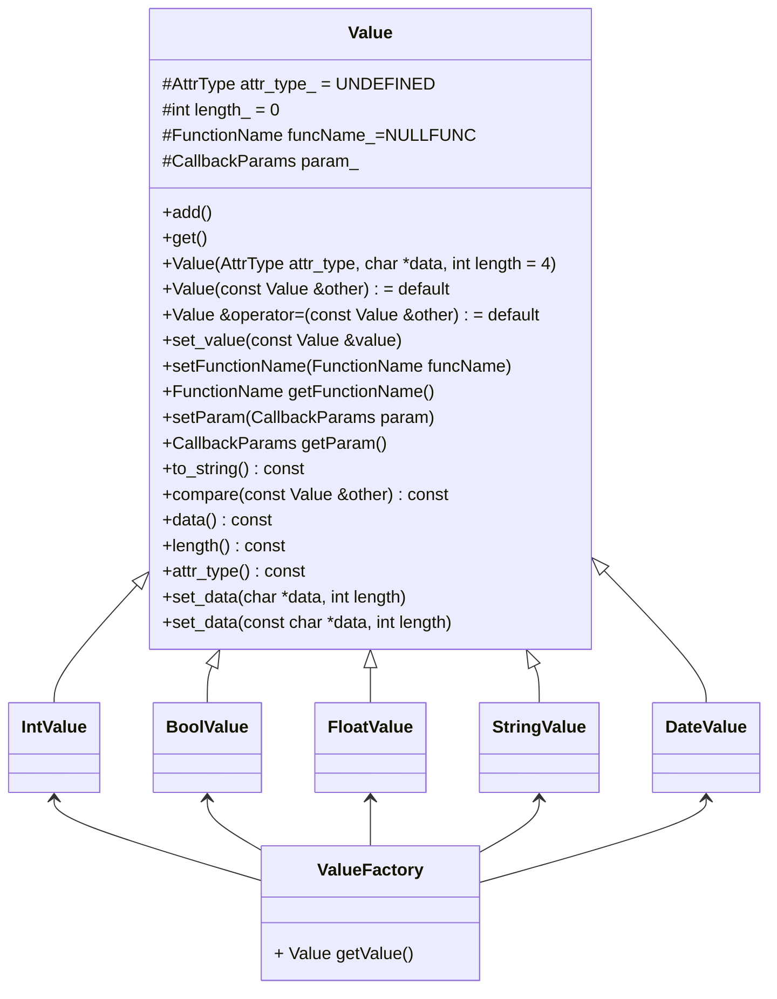

# 前端字段类Value架构改进方案

*By wuhuua*

## 1. 架构改进初衷

### 1.1 Value架构的前世今生

当前UnloadBase中前端Value架构设计主要用于select语句查询的最后封装，它提供了一个字段所需的全部特征，为该字段赋予了增删改查的全部能力，这继承自miniob 2023年下半年的前端架构改动，当时将索引、全表扫描中根据字段类型改变输出和处理方式的冗余逻辑抽象到一个value中进行，之后的修改上只需要修改value类的实现，简化了代码演进过程。

### 1.2 Value架构的局限性

然而对于UnloadBase更进一步的敏捷开发和代码可读性要求，Value类switch-case的实现方式既不优雅也缺乏对C++多态性的充分使用，比如Value类下面的实现，在一个类中有且只会存入一种数据类型，而随着字段类型的增加，类只会不断占用不需要使用的空间，在实现和维护上要不断补充switch-case的选择支。

```c++
  void set_date(const char *date);
  void set_int(int val);
  void set_float(float val);
  void set_boolean(bool val);
  void set_string(const char *s, int len = 0);
  void Value::set_value(const Value &value)
  {
    switch (value.attr_type_) {
      case DATES: {
        set_date(value.get_date()->toString());
      }break;
      case INTS: {
        set_int(value.get_int());
      } break;
      case FLOATS: {
        set_float(value.get_float());
      } break;
      case CHARS: {
        set_string(value.get_string().c_str());
      } break;
      case BOOLEANS: {
        set_boolean(value.get_boolean());
      } break;
      case UNDEFINED: {
        ASSERT(false, "got an invalid value type");
      } break;
    }
  }

  union {
    int int_value_;
    float float_value_;
    bool bool_value_;
  } num_value_;
  std::string str_value_;
  std::shared_ptr<Date> date_value_;
  FunctionName funcName_=FunctionName::NULLFUNC;
  CallbackParams param_;
};
```

### 1.3 Value架构局限性可能带来的问题

当我们试图为某一个字段添加特殊功能的时候，如：string类型的数据可以进行前缀比较，这是string的独有功能，甚至可能包括算法这些应该和业务逻辑隔离的模块，在Value设计中则需要先判断类型，在直接调用value内部实现的比较算法进行前缀比较，这是不合理的。

## 2. Value架构改动方案

### 2.1 文件组织架构设计

改动后Value架构的方案目前设计如下：

```c++
.
└── attr
    └── value
        ├── value_factory.cpp
        ├── bool_value.cpp
        ├── date_value.cpp
        ├── float_value.cpp
        ├── int_value.cpp
        ├── string_value.cpp
        └── value.cpp
        └── value.h
  
```

原有的value在src/observer/sql/parser层级下，现在可以使用UnloadBase使用的attr也即字段层进行处理，和前端实现分离


### 2.2 类组织架构设计



设计UML图中主要强调了对Value类的抽象，其中定义了的字段和函数应该按照定义的类型和可见性实现，其他有需要的函数也应该对照原来架构进行实现。